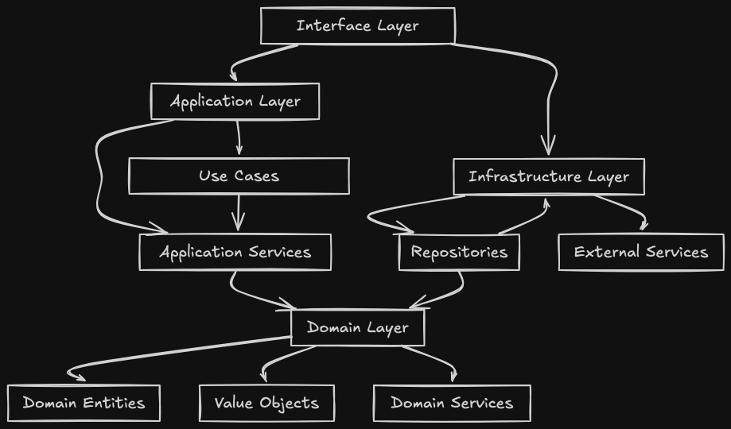

# Universeg API

```text
universeg-api/
├─ sql/                                // Database migrations / seeds (for SQLx or sqlx-cli)
└─ src/
   ├─ app/                             // APPLICATION layer (use case orchestration)
   │  ├─ usecases/                     // Use Cases (Application Services)
   │  │  ├─ auth/
   │  │  ├─ sales/
   │  │  └─ user/
   │  ├─ ports.rs                      // PORTS: contracts/traits for infrastructure (repos, jwt, hasher…)
   │  └─ mod.rs                        // Re-export and wiring for the application layer
   │
   ├─ domain/                          // DOMAIN layer (pure business logic, no frameworks)
   │  ├─ inventory/
   │  ├─ sales/
   │  ├─ user/
   │  └─ mod.rs                        // Domain re-exports (or shared domain types)
   │
   ├─ infrastructure/                  // INFRASTRUCTURE layer (adapters implement Ports)
   │  ├─ postgres/                     // Persistence adapters (SQLx repositories)
   │  │  ├─ pool.rs                    // Create and manage the DB connection pool
   │  │  └─ user_repo.rs
   │  ├─ security/                     // Security adapters
   │  │  ├─ jwt.rs                     // JwtService implementation (HS256, claims, expiration)
   │  │  └─ password.rs                // PasswordHasher implementation (bcrypt/argon2)
   │  ├─ config.rs                     // Load configuration from .env / environment variables
   │  ├─ errors.rs                     // Error mapping (domain/app errors → HTTP ApiError)
   │  ├─ logger.rs                     // Tracing initialization (levels, formatting, filters)
   │  └─ mod.rs                        // Infrastructure re-exports
   │
   ├─ interface/                       // INTERFACE layer (entry points: HTTP via Axum)
   │  ├─ rest/                         // REST delivery (controllers, routes, middlewares, DTOs)
   │  │  └─ mod.rs                     // Route registration and controller wiring
   │  ├─ bootstrap.rs                  // Composition root: builds dependencies, injects Ports into Use Cases
   │  └─ main.rs                       // Application entry point: start server, load config, mount router
   │
   └─ target/                          // Cargo build output (generated; should be ignored)

Cargo.toml                             // Rust dependencies, crate metadata, features
Cargo.lock                             // Locked versions of dependencies

```

## Architecture Diagram


